# Suggestion System Architecture

## 1. Problem Statement

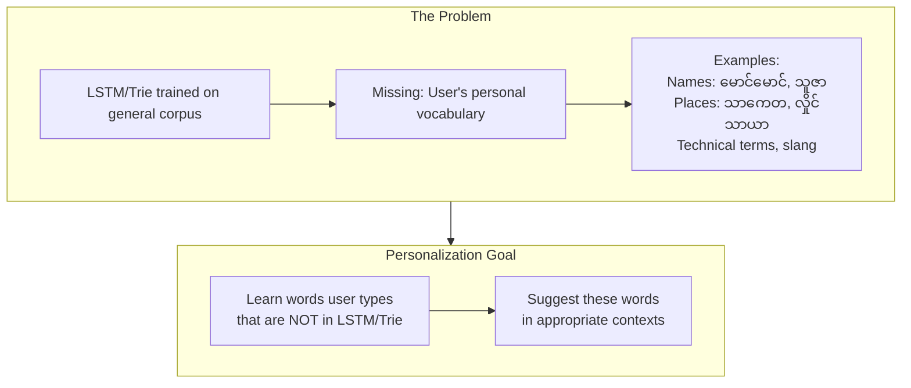

## 2. Current Implementation and Its Limitation

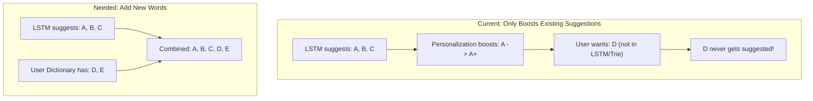

Current n-gram boost also risks conflicting with LSTM's context understanding:

| Component | Context Understanding |
|-----------|---------------------|
| LSTM | Full sentence (5 syllables) |
| Current Personalization | Simple frequency counts |
| Result | May boost contextually wrong word |

---

## 3. Key Challenge: Myanmar Word Boundary Detection

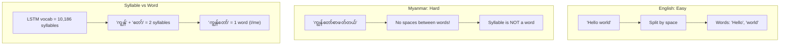

## 4. Solution: Composing Text for Word Detection

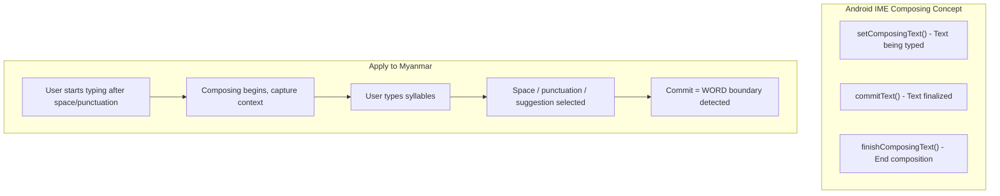

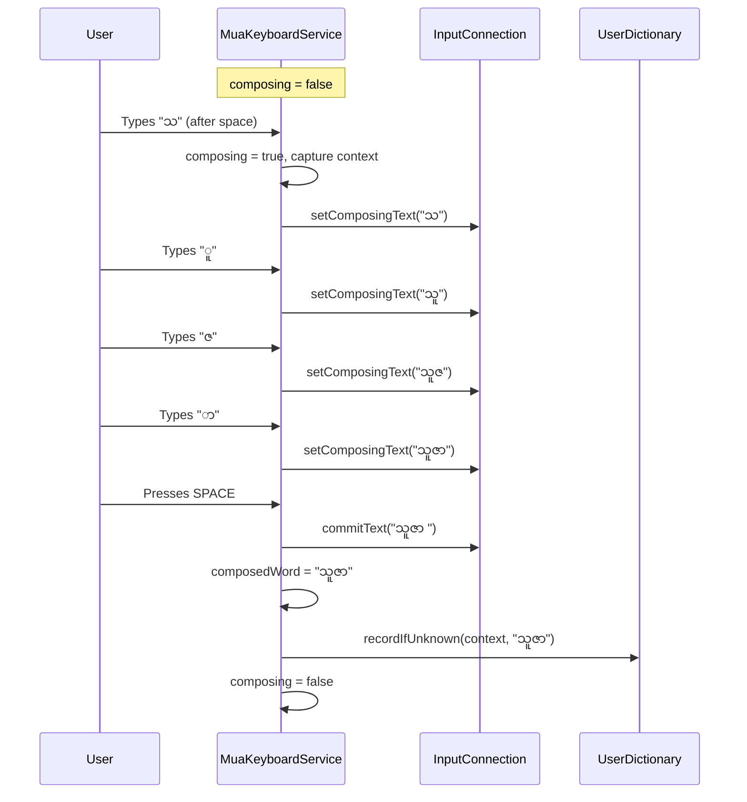

---

## 5. Design Decisions

### Context: Use 2+ Syllables

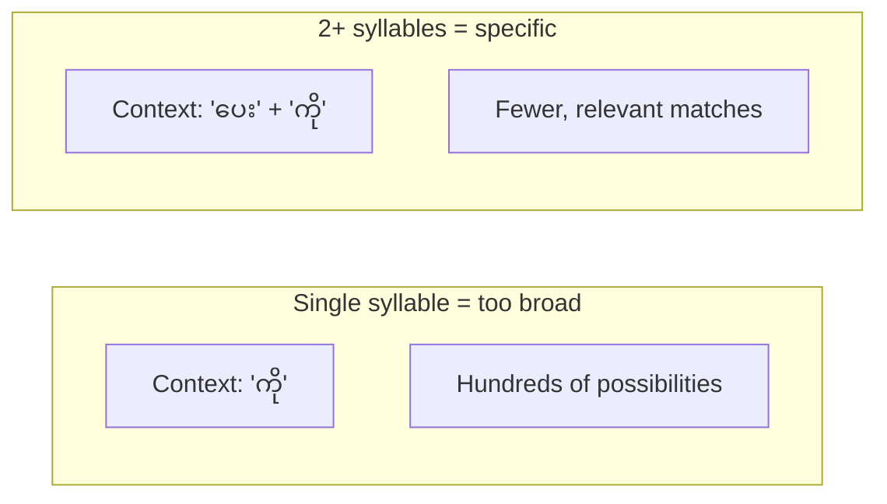

### Efficient Storage: Context-Keyed Trie

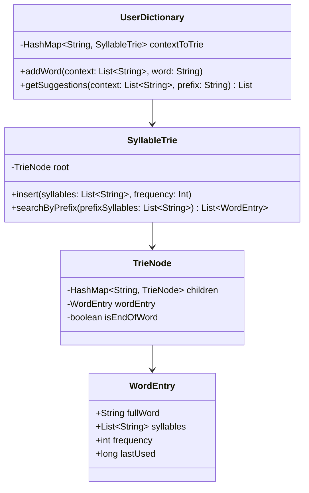

```
Example Storage:

contextKey = "ပေး|ကို"
    |
SyllableTrie:
    root
    +-- "သူ"
    |   +-- "ဇာ" -> WordEntry("သူဇာ", freq=5) [END]
    |   +-- "မ"  -> WordEntry("သူမ", freq=3)   [END]
    |   +-- "ငယ်"
    |       +-- "ချင်း" -> WordEntry("သူငယ်ချင်း", freq=2) [END]

Search prefix "သူ":
-> Returns: ["သူဇာ"(5), "သူမ"(3), "သူငယ်ချင်း"(2)]
-> Time: O(prefix_length + results_count)
```

### Vocabulary Check (Already Available)

```kotlin
// LstmNative.kt - returns -1 if syllable NOT in vocabulary
fun getIndex(syllable: String): Int

// LstmSuggestionEngine.kt - loaded from syll_indices_uni.json
private var syllableToIndex: Map<String, Int>  // 10,186 entries
```

---

## 6. Proposed Architecture

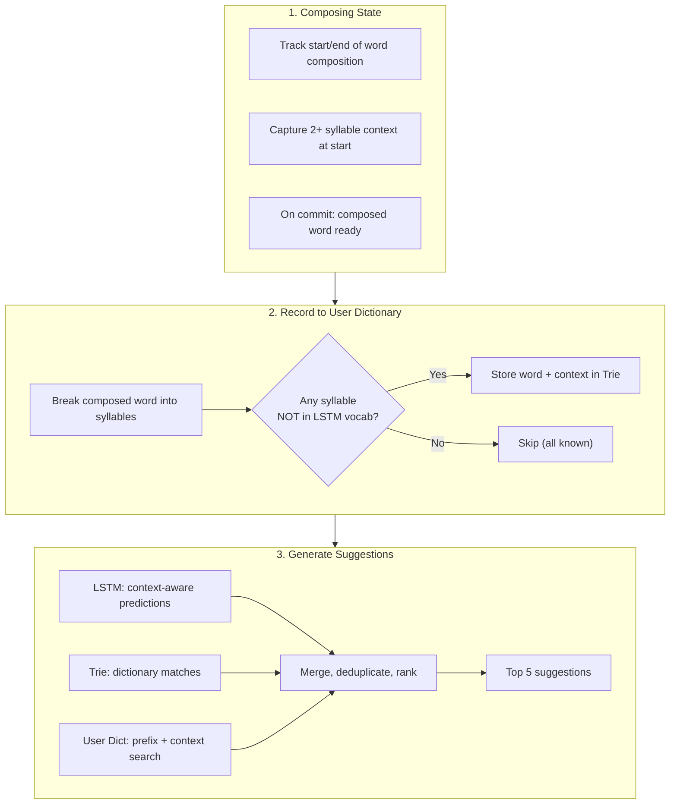

### Scoring User Dictionary Matches

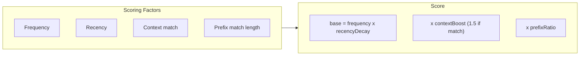

### End-to-End Example

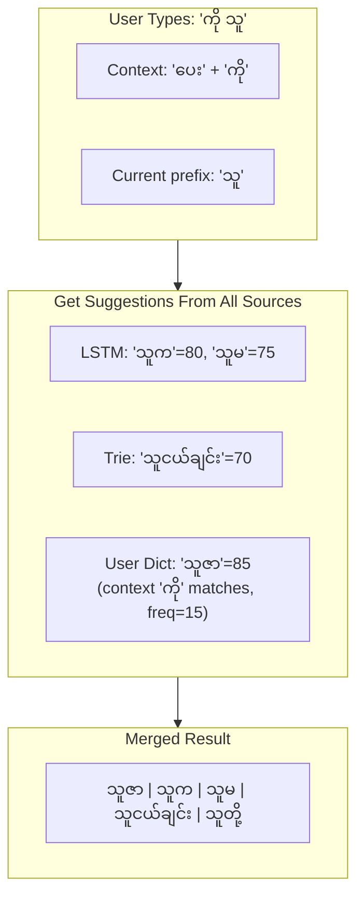

---

## 7. Comparison

| Aspect | Current Implementation | Proposed Implementation |
|--------|----------------------|------------------------|
| **Purpose** | Boost existing suggestions | Add new words + context matching |
| **Unknown words** | Cannot suggest | Can suggest from User Dict |
| **Context** | Simple n-gram frequency | 2+ syllable context key |
| **Word detection** | N/A | Composing state tracking |
| **Storage** | HashMap frequency counts | Context-keyed Trie |
| **Search** | N/A | Trie prefix search O(m+k) |
| **LSTM conflict** | May override LSTM | Works alongside LSTM |

---

## 8. Implementation Plan

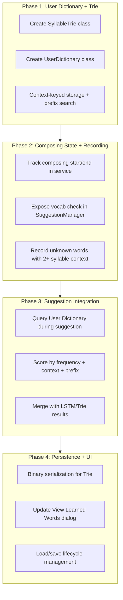

### Next Steps

1. **Create `SyllableTrie.kt`** - Trie with syllable-level nodes and prefix search
2. **Create `UserDictionary.kt`** - Context-keyed Trie storage with frequency tracking
3. **Add composing state tracking** in `MuaKeyboardService.kt`
4. **Expose vocab check** in `SuggestionManager.kt` (delegate to LSTM engine)
5. **Record unknown words** on commit with 2+ syllable context
6. **Query User Dictionary** during suggestion generation, merge results
7. **Add persistence** (binary serialization for the Trie structures)
